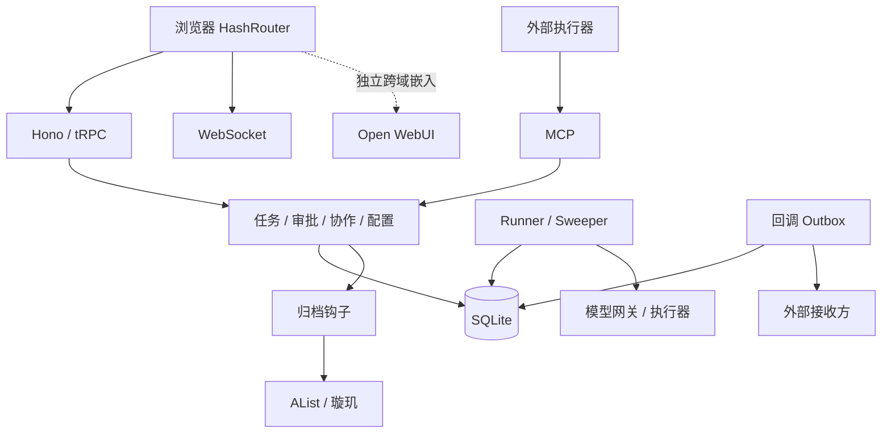
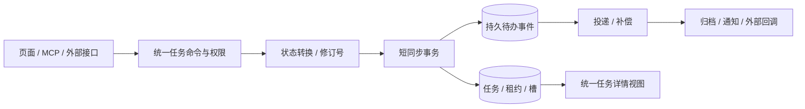

# 天宫架构评估与优化实施方案

基线：`284de8b`。日期：2026-09-16。本轮研究源码并联网查阅主源，只写本报告，不改业务代码、不发布、不操作线上数据。Hindsight不可用。代码事实不等于线上复现；尚无生产负载、成功率与用户操作时间基线。六月的ARCHITECTURE_V3.md仅作历史参考。

## 一、结论

保留React + Hono/tRPC + SQLite，先修正确性、收拢业务边界，同时简化用户操作。暂不重写或拆微服务。

任务、协作、执行、审批、通知、产物、归档、成本与集成的主要构件已经存在，但不能称所有入口均已完整闭环。当前优化应让现有能力可靠且易用，而不是再增加菜单。专业功能全部保留，高级参数折叠；简单不等于取消权限、预算和红线审批。

## 二、现状架构与功能完整性

| 层 | 实现及证据 |
|---|---|
| 页面 | React SPA，**HashRouter**（src/main.tsx:2-15）；App.tsx:32-111登录保护、布局与路由；Tasks.tsx:20-41四标签 |
| 接口 | Hono boot.ts、tRPC api/router.ts:40-79、MCP server.ts、WebSocket |
| 身份 | JWT用户、Agent Key、服务身份；middleware.ts:63-100,125-160 |
| 数据 | Node DatabaseSync、自研better-sqlite3兼容适配器、Drizzle；connection.ts:63-76，node-sqlite-adapter.ts:134-173 |
| 执行 | task-runner、task-claim、execution-gate、task-concurrency、sweepers |
| 结果 | task-finalize.ts:36-87、artifacts、璇玑/AList补偿与协作汇总 |
| 回调 | **已有**task-outbox持久队列、重试和dead letter（task-outbox.ts:97-132,155-242） |
| 部署 | boot.ts:475-541同进程启动Runner/sweeper/outbox；Dockerfile与持久卷配置 |

图示不代表所有写入已走统一服务。各能力均需按以下闭环验收，而非只看接口存在：

| 能力 | 已有 | 需要补齐或验证 |
|---|---|---|
| 创建编排 | 工作台、DAG、MCP、外部入口 | 重复提交与多入口一致性 |
| 分配执行 | Agent、Runner、槽、租约 | 事务、并发认领、迟到回写 |
| 审批预审 | 闸门、auto-approve、fusion-prereview | 保留红线，预审不等于批准 |
| 观察跟进 | 看板、通知、事件、会话镜像 | 任务深链断链及URL状态同步 |
| 结果归档 | 详情、artifact、AList、璇玑 | 取消/失败等终态出口一致，结果与归档状态分开 |
| 模型预算 | 默认/Agent/助手/兜底、usage/guard | 配置来源一致，探测时效与错误分类 |
| 集成聊天 | MCP、插件、GitHub、网盘、OWUI | 注册不等于可执行，嵌入不等于任务闭环 |
| 运维 | health、建表、审计、控制台 | 旧库升级、一致备份、恢复与readiness |

证据入口：src/App.tsx:81-102、api/router.ts:40-79、api/connector/registry.ts:17-36、src/sections/Dashboard.tsx:889-899。

## 三、当前优先整改项

以下“风险”为代码推断，未声称线上事故复现。

### 1. 事务与数据库契约（第一批）

- ~~**同步事务接async回调**~~ **✅ 本轮已修复**：原 node-sqlite-adapter.ts:134-147 在 `fn()` 返回后立即 COMMIT，而 async 回调此刻只返回了一个未完成的 Promise → 事务实际只覆盖到第一个 await 之前的语句，后段失败既回滚不掉、写入也已落库。**实际修法与本文初稿不同**：保留异步回调，改为等回调 settle 之后再 COMMIT/ROLLBACK，并新增「事务独占门」串行化并发事务（异步事务跨 await 后，第二个 BEGIN 会直接报 `cannot start a transaction within a transaction`）。之所以没按初稿改成全同步回调 + `.run()/.all()/.get()`：beidou-external-router.ts:370 在事务内调用了 async 的 `enqueueTaskOutboxEvent`，改同步会牵连该 helper，在高风险区域扩大爆炸半径。**实测证据**（真实 node:sqlite 适配器）：旧实现下「写入后抛错」残留 1 行已提交数据、并发事务回滚会连带抹掉他人写入、且 `maxConcurrentTasks=2` 时 5 个并发取槽全部成功；修复后 tests/api/node-sqlite-transaction.test.ts 与 tests/api/task-slot-concurrency-real.test.ts 全绿（7 文件 34 例）。**遗留（非阻塞）**：事务在 await 期间仍对同连接开放，同一 tick 内无关的微任务写入理论上会并入该事务；彻底消除需按初稿把调用方改为同步回调，可作为后续加固。
- **外部认领无CAS**：task-claim.ts:144-159先查后按id更新。单进程async也可能交错双认领。WHERE带预期状态/版本，检查真实affected rows，胜者才返回任务及触发副作用。
- ~~**MySQL返回值遗留**~~ **✅ 本轮已修复（比预估严重得多）**：原判断不止是"读不到 id"，而是让两条链路**必然失败**。实测采集真实形状：node:sqlite 的写入返回 `{ changes, lastInsertRowid }`，读 `insertId`/`affectedRows` 恒得 `undefined`，于是——① `artifact-sealer` 的 `Number(affectedRows) !== 1` 因 `NaN !== 1` 恒真，**制品封存 100% 报 stale_state**；② `beidou-external-router` 的 affectedRows 守卫同理**状态变更恒被拒**；③ 外部建单把 `NaN` 写进 `task_outbox_events.task_id`（NOT NULL），实测报 `NOT NULL constraint failed: task_outbox_events.task_id`，**整条外部建单链路失败**。修复：`api/lib/insert-id.ts` 补 `getAffectedRows`（**绝不返回 NaN**，无法识别时返回 0），并把 11 个文件里各自为政的实现（含 `agent-router` 只读 affectedRows 的坏版本、`external-agent-router`/`audit-log`/`xuanji-sync` 只读 insertId 的版本，以及 guard/github/message/mailbox/ai-assistant 的重复实现）统一到共享契约，各处的 `null`/`undefined` 语义用薄包装保留。验证：新增 `tests/api/insert-id-contract.test.ts` + `tests/api/beidou-external-real.test.ts`（**真实 SQLite 适配器**，既有 fake-db 测试正因返回 MySQL 形状而完全掩盖了该 bug）；把旧读法还原即复现上述 NOT NULL 报错（3 例全红）。
- ~~**幂等错误码**~~ **✅ 本轮已修复**：实测采集 node:sqlite 的唯一冲突形状为 `code=ERR_SQLITE_ERROR, errcode=2067(SQLITE_CONSTRAINT_UNIQUE), message="UNIQUE constraint failed: tasks.origin_system, tasks.external_ref"`（复合唯一索引会列全列名；注意 origin_system 为 NULL 时 SQLite 不判冲突，这一点曾误导排查），而旧代码判断的 `ER_DUP_ENTRY` 在 SQLite 下**永不出现**。后果：正常重复请求走前置查重所以没暴露，但**并发竞态**下撞约束的一方直接把 SQLite 错误抛给调用方，而不是回退为幂等成功。修复：新增 `api/lib/db-error.ts` 的 `isUniqueConstraintViolation(error, {table, columns})`——按 errcode 精确识别唯一冲突，并在消息带表列信息时精确到列（其他表/其他列、NOT NULL、外键一律不认，满足"不能把所有 constraint 错误都当幂等成功"）；消息不含表列信息时（老驱动索引名、测试替身）交给调用方回查 canonical hash 兜底。验证：`tests/api/db-error.test.ts` 含**真实驱动产出错误对象**的断言；`beidou-external-real.test.ts` 的并发用例在旧判断下 red（`expected 'rejected' to be 'fulfilled'`）、新判断下 green。
- ~~**外部认领无CAS**~~ **✅ 本轮已修复**：`task-claim.ts` 原为「先查后按 id 更新」——`findClaimableTask` 查到 queued 任务后用 `.where(eq(tasks.id, task.id))` 无条件置 running。两个 Agent 在同一 tick 并发认领时双方都查得到、双方 UPDATE 都成功（后者覆盖前者的 `agentId`），于是**同一任务被两个 Agent 同时认为归自己 → 重复执行**。修复：WHERE 带上预期状态（`tasks.status = "queued"`）形成 CAS，用 `getAffectedRows`（本轮新增的共享契约）按真实受影响行数裁决；新增 `already_claimed` 原因码，败者不返回任务、也**不把 Agent 置为 busy**（否则会留下"无任务却 busy"的卡死 Agent）。验证：新增 `tests/api/task-claim-cas.test.ts`（**真实 SQLite 适配器**）——修复前两 Agent 均认领成功（`expected [...] to have a length of 1 but got 2`），修复后恰好一个胜出且败者非 busy。调用方对新原因码均为宽松处理（MCP 直通、agent-router 仅在 `agent_not_found` 时抛错），无需改动。

### 2. 权限边界（第一批）

- boot.ts:423-467的/ws/dashboard直接upgrade并注册广播，没有端点鉴权。前端登录保护不能替代接口认证。增加握手认证、授权范围、Origin验证。部署是否另有网关保护本轮未核实。
- 浏览器原生WebSocket仅接受url/protocols，不能任意加Authorization header。可用安全会话或短期一次性ticket；MCP HTTP客户端可用header。长期密钥query逐步淘汰并脱敏日志。
- mcp/mcp-router.ts:64-77的revealKey使用authedQuery且无归属过滤；middleware.ts:129-136允许用户或Agent Key。收紧管理/归属权限；测试非授权身份不能读取完整Key，不输出真实秘密。

### 3. 回调、归档和任务状态（第一批至近期）

- **Outbox饥饿**：task-outbox.ts:189-209先无筛选limit100，再JS过滤未完成/到期。前100条若都结束，后续待发送可能持续取不到。改SQL WHERE+稳定ORDER BY+LIMIT，测试超过100条历史记录。
- running标志（task-outbox.ts:212-239）仅进程内；补有期限的claim/lease，接收端按eventId幂等。目标是至少一次投递+幂等消费，不能承诺网络场景绝不重复。
- task-finalize.ts:36-87有归档钩子，但MCP取消server.ts:1170-1173直接failed；超时sweepers/task-lifecycle.ts:50-96自行写状态、教训、通知。统一终态转换及后续动作，保留成功/失败/取消语义。
- db/schema.ts:94-119的status/lifecycleStatus/boardStatus是不同维度。以单一transition服务维护一致投影和修订号，不粗暴合成单枚举。
- 扩展现有可靠投递机制覆盖内部归档/通知时，区分内部接收端和现有外部callback binding，不能强迫内部归档配置外部回调密钥。

### 4. 旧库升级、备份和就绪状态（近期）

- ✅（本轮完成，仅补列部分）auto-migrate.ts主要CREATE IF NOT EXISTS，:790-808补列函数no-op；bootstrap-mysql-import.ts:120非MySQL提前return，而repair原在:131（**提前返回之后**）→ 结论确认：**旧原生SQLite从来不补列**。已改为：补列统一在 autoMigrate 建表之后执行（对所有 DSN 生效，bootstrap 里那份删除并留注释说明教训）；补列清单从**手写**改为**从 db/schema.ts 派生**（原手写清单只列 13 个 tasks.board_*，下次往 schema 加列仍会静默漏）；SQLite 拒绝补的列（表达式默认值如 unixepoch()、PRIMARY KEY、NOT NULL 且无常量默认值）进 skipped 并打日志，不静默略过也不降级成可空列。证据：tests/api/schema-upgrade.test.ts（6 个，含复刻 13 列历史事故、派生性、skip 上报、幂等、真实 drizzle 查询可用）+ tests/api/schema-upgrade-boot.test.ts（跑真实 autoMigrate 两轮：建库 → 删列 → 重启必须补回；已用"撤掉接线"验证过 RED）。**剩余**：版本迁移以减少 schema/DDL/repair 多份定义；NOT NULL+表达式默认值的列需要表重建，当前只上报不处理。
- ✅（本轮完成）关键迁移失败readiness=false且不接单；可选集成失败则降级。boot.ts:75-94仅尝试getDb的health不足以证明迁移和执行器就绪。已改为：新增 api/lib/readiness.ts（单一判定源，**fail-closed**：未跑完即未就绪），四个关键环节——迁移（含**schema 漂移**：补列被跳过即代码要用的列不存在，运行时必报 no such column）、任务执行器（taskRunner.start）、事件派发（taskOutboxDispatcher.start）——全部就绪才算 ready；MySQL 导入等可选集成只记 degraded 不翻转 ready。**liveness 与 readiness 分开**：/health 仍是 liveness（只答"进程活着、库能开"，不就绪**不**返 503，避免编排层重启放大故障），新增 /ready 探针返 503+可读原因，/health 里也带 ready/reasons。"不接单"落在两处：`claimNextTask` 入口（tRPC 面与 MCP 工具面共用，未就绪返回 `reason:"not_ready"`）与派发循环 `TaskOutboxDispatcher.tick`（事件留在 outbox 不丢，就绪后照常派发；闸门只拦循环、不拦纯函数以保持其可直测）。证据：tests/api/readiness.test.ts（8 个，含未就绪不得认领：任务保持 queued、Agent 不被置 busy；以及就绪后同一任务可正常认领，证明闸门不误伤）。**顺带修复**：`tests/api/helpers/fake-db.ts` 的写入返回值是 MySQL 形状（`insertId`/`affectedRows`），与真实驱动 `{changes, lastInsertRowid}` 不符，导致"按受影响行数裁决"的代码在假 DB 下恒判失败——已补齐真实形状并保留旧别名；execution-gate / connector-mcp-auth / notifications-business-hooks 三个文件因此暴露出**自 Phase A CAS 提交（0b51e25）起就已变红而未被发现**（当时的回归清单未覆盖它们），现全绿。
- 用SQLite backup API或VACUUM INTO生成一致快照，再校验、加密、上传与轮换。**不能在线逐个cp数据库/WAL/SHM**；checkpoint后继续写也不能保证随后复制一致。另一方案是停写并关闭相关连接后备份。必须恢复演练。
- WAL/busy_timeout是条件性调优，不是无条件P0：核实实际journal、卷文件系统、锁等待和备份方式。WAL仍单写，不保证无BUSY，不自动支持多实例。

## 四、目标架构：模块化单体

逐步收拢五个边界，不全站同时改：

1. 任务服务：创建、认领、审批、进度、完成、取消、重试；协议层只校验和调用。
2. 执行服务：Runner/外部适配、租约、能力与预算检查。
3. 结果服务：产物清单、下载权限、归档状态、补传；执行完成与归档完成分开。
4. 配置服务：统一网关地址、模型优先级与有效配置。task-runner.ts:113、tianshu-router.ts:16、ai-assistant.ts:56默认URL需收敛。AList settings密码（api/connectors/alist.ts:87-97）迁现有Vault，明确兼容期与明文清理时点。
5. 页面读模型：统一详情和操作面，旧接口/路由经适配保持兼容。

## 五、傻瓜式操作方案（近期并行推进）

### 三步用户旅程

| 步骤 | 用户操作 | 系统职责 |
|---|---|---|
| 提出任务 | 一个主入口，描述目标，必要附件，可选模板 | 检查执行器/模型/预算，高级参数折叠；缺配置明确指出，不静默排队 |
| 跟进处理 | 看排队/执行/待确认/失败原因 | 自动更新、按策略恢复与重试；审批只在需要时出现 |
| 收取结果 | 同一详情看结论、下载、归档状态 | 合并协作结果、归档通知；失败给安全明确下一步 |

自动审批只在启用且策略允许时生效，预审只是意见，红线保持人工。引导嵌入现有表单和空态，不建重复向导。

### 导航：功能保留而非删除

主导航先考虑“工作台、任务、对话、通知”，再依据使用数据校准。当前用户使用对话/OWUI，不应未经验证全部藏入管理区。模型、Agent、集成、费用、事件、审计进可展开高级组，允许固定常用入口。

建立旧入口→新入口→权限→验收映射，保留App.tsx:84-85,93-94旧路由重定向。菜单隐藏不能替代服务器授权。

### 具体操作断点

- ~~**会话任务深链**~~ **✅ 本轮已修复**：原 SessionPanel.tsx:220 发 `/tasks?task=N` 有两处失效——(a) Tasks.tsx 缺省 center 使 TaskBoard 根本不挂载；(b) TaskBoard.tsx:20 读 `window.location.search`，而 HashRouter 下该值恒为空字符串（已用 URL 解析实证：search=`""`、hash=`#/tasks?task=5`），故深链从未生效。修法：SessionPanel 直接跳 `/tasks/:id` 详情页（与通知中心 NotificationItem.tsx:146 的既有可用路径一致）；旧式 `?task=` 契约（docs/APPROVAL_AND_PREREVIEW.md:74）不废弃，改为 TaskBoard 用 useSearchParams 正确读取，且 Tasks.tsx 在「带 task 无 tab」时缺省落 board，用户显式切 Tab 时清掉 task 以免刷新被拉回。
- Tasks.tsx:16称切回保持状态，但条件卸载会丢local state；选择性保存草稿/筛选/滚动，明确范围，不无故加全局状态库。拆:47,78-83嵌套整页壳，减少重复顶部留白。
- **Fusion分清两链**：旧页面无路由不等于预审无UI，预审在TaskDetailModal.tsx:1014-1015,1185渲染。旧#/fusion兼容到审查上下文或只读历史；未接消费端的审查链禁启动并解释，不复活永久pending按钮，不再加重复主面板。
- **OWUI独立边界**：Dashboard.tsx:889-899跨域iframe，天宫CSS不能修改内部界面，不自动共享任务/归档/登录。保留聊天与新窗口；未来对话转任务必须明确提交确认，不能默认导入全部聊天。
- **探测反馈**：tianshu-router.ts:164-225串行、resp.ok判断、合并旧缓存；补协议校验、逐条检测时间/TTL、错误分类和有预算的有限并发，探测不等于预算批准。
- **修复反馈**：timestamp-repair.ts:93-101,123-130捕获错误却无失败清单；跳过扫描不能称全部干净。需预览、备份、部分成功报告。已有单测不证明这些边界。
- **移动端**：保留适配，逐页明确布局替代宽泛CSS；360/390/768px、横竖屏、键盘、长文本、弹窗视觉回归，构建不能替代视觉验收。

### 简单运维

复用首页/控制台显示“能否接单”：数据库/迁移、执行器、模型、存储、待补送数量。只要求所选功能必要配置，纯文本任务不因网盘未配一律被挡。启动升级后页面指出缺项，不要求用户手工SQL。秘密在专门安全设置界面配置，不通过聊天索取。

## 六、按依赖推进的路线

工期是熟悉项目的单名开发者粗估，需实施前测试细化，不是交付承诺。

| 阶段 | 内容 | 依赖与验收 |
|---|---|---|
| A立即，约1–2周 | 权限、真实SQLite事务、返回值/幂等/CAS、outbox筛选、深链 | ~~A~~ **✅ 已完成（本轮）**。验收五条全部有实测证据，映射见下方对照表 |
| B近期，约2–4周 | 旧库迁移/readiness、一致备份恢复、统一终态/归档、配置自检、渐进表单、统一结果 | A；新增列先迁移备份。旧库升级不丢数据，迁移失败不接单，全部终态结果/审计一致，新用户三步可完成 |
| C中期，约1–2月 | 模块收拢、内部副作用持久投递、通知去重、模型缓存限额、Vault、插件状态、移动端/文档 | A+B；保持外部回调协议。重启后待办恢复，重复投递无重复业务效果，入口/权限/恢复测试齐 |
| D条件性未来 | 多实例/数据库、持久工作流、模板与质量反馈 | 用生产指标和需求证明瓶颈与收益后再引入 |

阶段补充：任务深链属于A阶段立即修复；Outbox claim/lease在C阶段落地，并作为任何多实例试运行的前置门槛，A阶段先修SQL筛选与事务契约。

定向测试→独立审查→灰度/开关→观察→下一入口。本容器仅小范围验证，全量/压力测试在独立环境。应用回滚不等于数据回滚；迁移先扩展兼容、切流、再收缩。不要把所有项当成独立低风险改动。

## 七、未来方向及触发条件

- 高频任务沉淀少量模板，解释模型/执行器选择和预算，不急建市场。
- 关联用户验收、重做、产物可用性与费用，样本不足不自动增费用或减审批。
- 跨部署恢复、人工等待、复杂步骤维护持续成为成本时评估Temporal，不仅凭任务时长阈值。
- 先测锁等待、BUSY率、排队延迟、恢复时间和高可用需求，再评估PostgreSQL/多实例。ORM方言类似不等于迁移便宜；SQL/时间/事务/错误码/数据均须验证。
- 集成按未配置/已配置/连通/可执行/降级展示；注册卡片不等于能执行；保留协议签名版本兼容。
- 使用数据决定合并信息面，保留用户常用入口，手机优先待办与结果。

## 八、验收清单与指标

以下为建议目标，尚无实测基线，先采集：

1. 所有导航、旧链接、通知/会话深链刷新与前进后退可用，手机桌面一致。
2. 重复点击/网络重试不重复建任务，配置不足明确提示；未认证Dashboard WS握手被拒，非授权用户/Agent不能revealKey，ticket过期/重放被拒，长期query密钥淘汰后日志不残留秘密。
3. 内外认领唯一；重启/超时可恢复；迟到回写不覆盖新租约代际。
4. 批准/拒绝/红线/预算/预审分开测试，默认开关与文案一致。
5. 成功/部分成功/失败/取消/归档待补送分清；产物可下载。
6. 超过100条历史outbox仍消费，失败补送和dead letter可观察/重试，接收端幂等。
7. 旧库加列、迁移失败、备份还原演练；建议RPO≤24h、RTO≤30min，实测调整。
8. 管理员配置后，5位新用户至少4位无需文档可创建/跟进/取结果；建议首任务准备≤3分钟，待用户测试。
9. 采集成功率、重试率、排队P95、归档延迟、待补送年龄、BUSY率、单任务费用；进程活着不等于能接单。

## 九、联网来源与采用边界

- [SQLite WAL](https://www.sqlite.org/wal.html)：并发/共享内存约束，不用于断言生产容量。
- [SQLite Backup API](https://www.sqlite.org/backup.html)：一致在线备份。
- [Node SQLite](https://nodejs.org/api/sqlite.html)：DatabaseSync，与本仓适配器共同判断事务。
- [tRPC](https://trpc.io/docs)：类型安全不保证业务闭环。
- [React状态保留与重置](https://react.dev/learn/preserving-and-resetting-state)：条件卸载生命周期。
- [MDN WebSocket构造器](https://developer.mozilla.org/en-US/docs/Web/API/WebSocket/WebSocket)：url/protocols，不支持任意header参数。
- [W3C WAI表单](https://www.w3.org/WAI/tutorials/forms/)：标签、分组、错误反馈和渐进指导。
- [Transactional Outbox原始说明](https://microservices.io/patterns/data/transactional-outbox.html)：模式作者主源，非厂商规范；事务与重复消费要求，不是有表就保证原子性。
- [Temporal持久执行](https://learn.temporal.io/tutorials/typescript/background-check/durable-execution/)：未来备选，不建议当前直接引入。

外部资料说明机制，天宫事实以代码为准。本版经主代理交叉核验，替代初稿过度乐观结论；未宣称线上端到端验收。

### Phase A 验收对照（本轮收口）

| 验收标准 | 证据（真实 SQLite 适配器） | 状态 |
|---|---|---|
| 非授权拒绝 | `tests/api/ws-ticket.test.ts`（14）+ 生产实测：恶意 Origin 无凭据 101→**403** | ✅ |
| 中途失败回滚 | `tests/api/node-sqlite-transaction.test.ts`（4）：写入后抛错残留 0 行 | ✅ |
| 重复请求同任务 | `tests/api/beidou-external-real.test.ts`（3）+ `tasks-external-identity.test.ts`（8）：含并发竞态幂等回退 | ✅ |
| 双认领一成功 | `tests/api/task-claim-cas.test.ts`（2）：修复前两 Agent 均认领成功 | ✅ |
| 100历史条后新事件可发送 | `tests/api/task-outbox-starvation.test.ts`（3） | ✅ |

收口验证：6 文件 / 34 例全绿；`tsc -p tsconfig.server.json` 干净。

超出路线图范围、但本轮实测发现的**生产级缺陷**（均已修复并验证）：
- 制品封存（artifact-sealer）受影响行数守卫恒真 → **封存 100% 报 stale_state**；
- 北斗状态变更守卫同理 → **恒被拒绝**；
- 外部建单把 NaN 写入 `task_outbox_events.task_id` → **整条建单链路 NOT NULL 失败**；
- 任务认领无 CAS → **同一任务被两个 Agent 同时认领、重复执行**；
- 并发重复建单撞唯一约束 → 直接把 SQLite 错误抛给调用方，而非幂等回退。

**遗留（诚实标注，非阻塞）**：`artifact-sealer` 的修复只做了共享契约层 + 真实驱动的验证，**未**跑通整条封存端到端路径（需要制品卷环境，本容器不便搭建）；生产并发时序亦无法在本地复现，只能靠单元/集成层证明。
